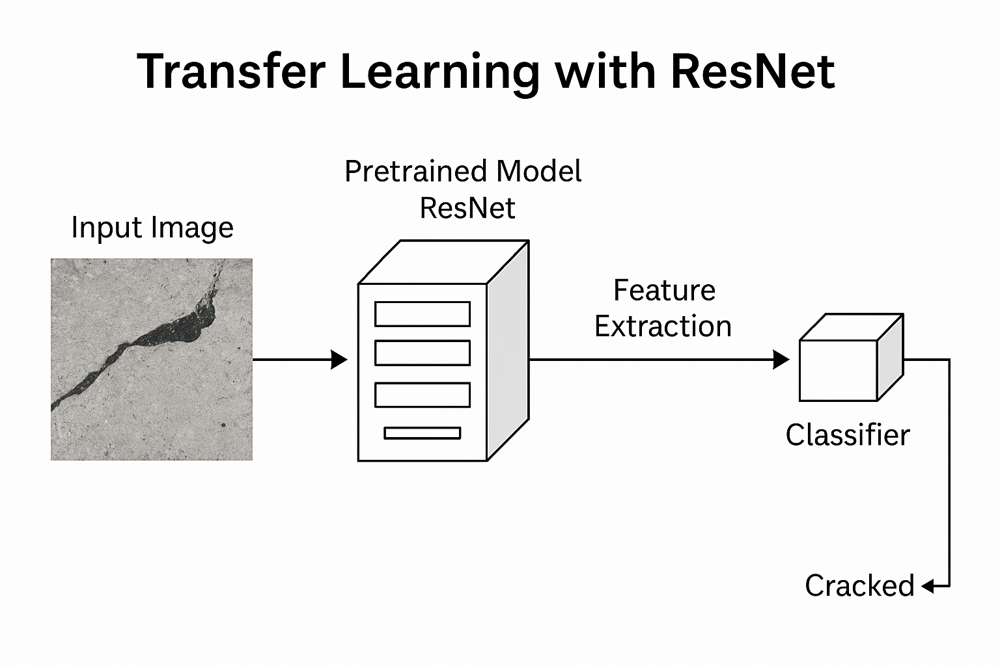

  # 🧠 Crack Detection using Transfer Learning (ResNet50 + PyTorch)

This project demonstrates how to classify **surface cracks in concrete** using **Transfer Learning** with **ResNet50** in PyTorch. Achieved over **99% accuracy** on a real-world dataset sourced from Kaggle.

---

## 📌 Problem Statement

The task is to classify whether a surface image contains a **crack** or not – a binary image classification problem.

---

## 🧪 Dataset

- 📥 [Concrete Crack Detection (Kaggle)](https://www.kaggle.com/datasets/arunrk7/surface-crack-detection)
- 40,000 labeled images (227x227 px)
- 2 classes:
  - `Positive` (Cracked)
  - `Negative` (Not Cracked)

---

## 🔧 Tools and Libraries Used

- Python 🐍
- PyTorch ⚡
- Google Colab
- Transfer Learning with ResNet50 (pretrained on ImageNet)
- Matplotlib, Seaborn

---

## 🛠️ Model Architecture

- **Base Model:** `resnet50(pretrained=True)`
- **Final Layer:** `nn.Linear(2048, 2)`
- **Loss Function:** `CrossEntropyLoss`
- **Optimizer:** `Adam`
- **Epochs:** 5
- **Batch Size:** 32

---

## 📈 Results

| Metric           | Value         |
|------------------|---------------|
| Training Acc     | 99.16%        |
| Validation Acc   | ~98.73%       |
| F1-Score         | 0.99          |
| Precision        | 0.98 (class 0)|
| Recall           | 0.99 (class 1)|

---

### 📊 Confusion Matrix


### 📋 Classification Report

| Class     | Precision | Recall | F1-Score | Support |
|-----------|-----------|--------|----------|---------|
| Negative  | 0.98      | 1.00   | 0.99     | 3933    |
| Positive  | 1.00      | 0.98   | 0.99     | 4067    |
| **Macro Avg** | 0.99 | 0.99   | 0.99     | 8000    |
| **Weighted Avg** | 0.99 | 0.99   | 0.99     | 8000    |


---

### 📷 Sample Predictions


Random predictions from the validation set show strong visual confirmation of the model's performance.

---

## 🧠 Transfer Learning Explained



We reuse pretrained convolutional layers from ResNet50 (trained on ImageNet), freeze them, and fine-tune a new classifier for our binary task.

---

## 📁 Folder Structure

crack-detection-resnet50/ 
├── Concrete_Crack_Detection_Analysis.ipynb
├── sample_output/ 
                ├── confusion_matrix.png 
                │── predictions.png 
├── assets/ 
          │── resnet_diagram.png 
├── resnet50_crack_model.pth
├── README.md

---

## How to Run

1. Clone the repository:
```bash
git clone https://github.com/DeepshikhaM/crack-detection-resnet50.git
cd crack-detection-resnet50
```
2. Open the notebook in Google Colab

3. Upload and unzip the dataset from Kaggle

4. Run all cells to train and evaluate the model

---
🙌 Author
Deepshikha Mahato
https://www.linkedin.com/in/deepshikha-mahato-5b2234125/

